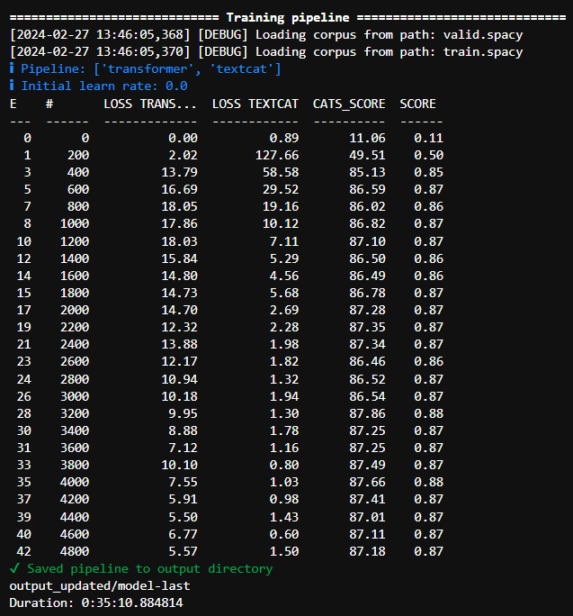
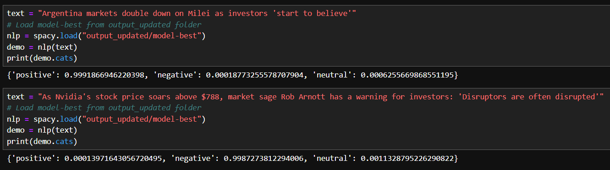
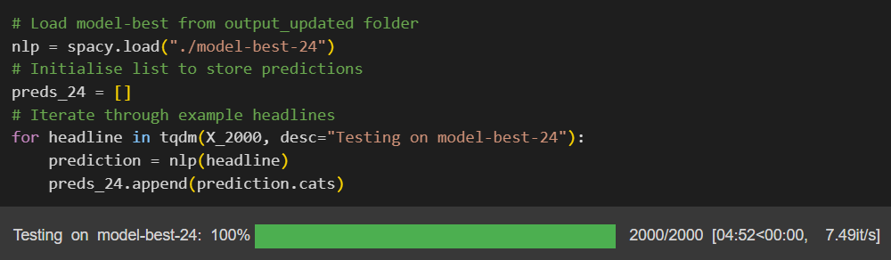
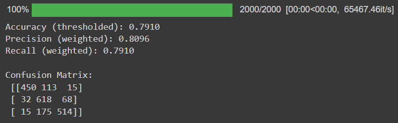
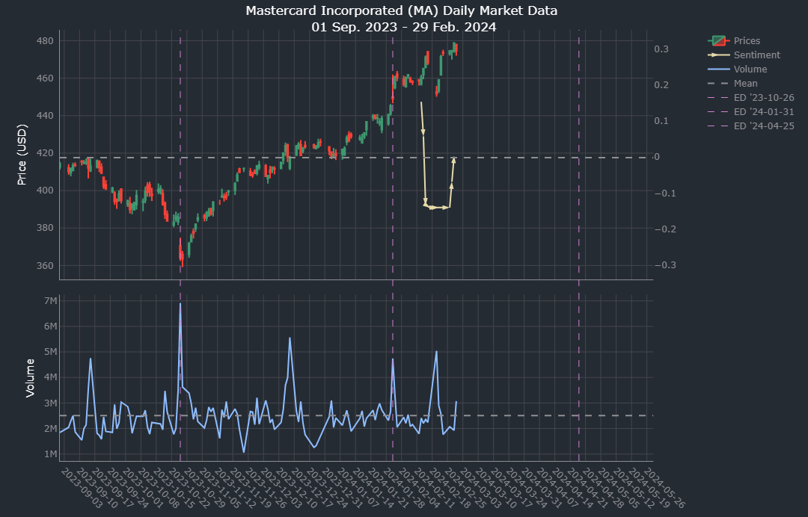
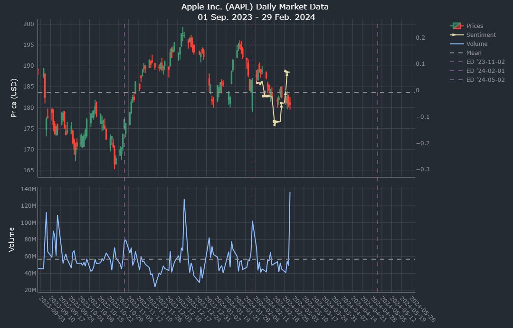

# Stock Sentiment Analysis with spaCy Transformers

## Overview

We developed this app as a proof of concept for the use of natural language processing (NLP) sentiment analysis models in securities market analysis. We sought to enhance standard price analysis through the use of spaCy's state-of-the-art transformer models, to introduce a measure of aggregate market sentiment over time that can facilitate informed trading decisions.

Transformer models are neural networks that learn context and meaning from sequential data. Since first emerging in the 2017 Google paper [Attention is All You Need](https://research.google/pubs/attention-is-all-you-need/), transformers have earned widespread recognition for their sophistication in sentiment analysis and text classification, and underpin many groundbreaking technologies such as ChatGPT and other large language models (LLMs), among other applications.

To measure market sentiment, we adapted a transformer model to classify the sentiment of financial news headlines.

### App

Our application features three main components: the [yfinance](https://github.com/ranaroussi/yfinance/tree/main) Python library, which returns ticker data (price history, company information, etc); [News API](https://newsapi.org/), which returns news results for keyword searches (in this case, the name of the organisation or fund associated with a ticker); and a sentiment analysis model built on top of a spaCy transformer model.

The first two components integrate with the app via calls to retrieve information, followed by data processing to prepare the responses for the NLP model and chart output.

The third component - the NLP model - is introduced below in detail.

## spaCy transformer model

spaCy is a leading Python library for use in advanced NLP applications. We employed spaCy's "[en_core_web_trf](https://spacy.io/models/en#en_core_web_trf)" model, a large English-language transformer model that has been pre-trained for general purpose use.

The en_core_web_trf model we selected makes use of the RoBERTa ("Robustly optimised BERT approach") baseline model, which has been pre-trained on a massive corpus of text and code.

To improve the performance of our model in classifying the sentiment of market news, we selected a dataset of financial news headlines posted on Twitter ([twitter-financial-news-sentiment](https://huggingface.co/datasets/zeroshot/twitter-financial-news-sentiment/tree/main)) to train our model on, and a separate dataset of financial headlines unseen during training ([Aspect based Sentiment Analysis for Financial News](https://www.kaggle.com/datasets/ankurzing/aspect-based-sentiment-analysis-for-financial-news)) on which to test the model.

### Training and hyperparameter selection

The spaCy software library supports the ability to fine-tune models by adjusting pre-defined hyperparameters for a specific task.

In order to identify the optimal combination of hyperparameters for our purposes, we conducted a grid search to find the best-performing combinations against our training data. The hyperparameters adjusted during training were as follows - the Baseline column displays the default settings of the en-core-web-trf model:

| Hyperparameter | Baseline | Variant 1 | Variant 2 | Variant 3 | Variant 4 |
| -------------- | -------- | --------- | --------- | --------- | --------- |
| Batch size     | 128      | 64        | 256       | N/A       | N/A       |
| Dropout rate   | 0.1      | 0.25      | N/A       | N/A       | N/A       |
| Learning rate  | 5e-05    | 5e-04     | 2e-05     | 3e-05     | 4e-05     |

Batch size refers to the number of data samples processed together during training, which involves a trade-off between training speed and accuracy. Dropout rate is the probability of randomly dropping out neurons, which is useful to prevent a model from overfitting to the training data. Learning rate controls how much the model updates its internal parameters based on error signals.

Training transformer models is computationally expensive. To do so, we employed a combination of GPU on local machines, and cloud GPU instances using the Vast.ai platform.

In total, we trained 25 different models out of variations of the above - some combinations such as the 5e-04 variants were abandoned once early iterations found them to remain stuck in local minima with poor performance (below 30% accuracy). Training times for those models that reached completion ranged between 18 to 86 minutes.

A sample readout from the training process is displayed before - in this case, for Model 24:

Through the grid search we selected the five best-performing models on the training data, based on their accuracy, transformer loss, and textcat loss measures, as well as a short test on nine financial headlines to identify obvious mistakes that should exclude a model from the shortlist.

An example outcome for two of the headlines that Model 3 (Baseline) was run on post-training is displayed below.

The five shortlisted models included the baseline and four others, as follows:

| Hyperparameter / Metric   | Model 1      | Model 3 (Baseline) | Model 15      | Model 20      | Model 24     |
| ------------------------- | ------------ | ------------------ | ------------- | ------------- | ------------ |
| Batch size                | 128          | 128                | 64            | 64            | 256          |
| Dropout rate              | 0.1          | 0.1                | 0.25          | 0.25          | 0.1          |
| Learning rate             | 4e-05        | 5e-05              | 5e-05         | 2e-05         | 2e-05        |
| Training accuracy         | 0.8761313895 | 0.8694786874       | 0.8669965736  | 0.8746381989  | 0.8786188685 |
| Training transformer loss | 12.986222384 | 24.6332577215      | 17.2053568307 | 13.9669502794 | 9.9503643669 |
| Training textcat loss     | 2.983950779  | 2.0546085536       | 5.9359531565  | 2.3785858391  | 1.2961502752 |

Based on training outcomes, the best-performing model appeared to be Model 24, which exhibited a close to 1% improvement in accuracy over the Baseline model, and the lowest loss measures - which capture the differences between predicted and actual outcomes, as well as the confidence of the models in making those predictions.

### Testing

To mitigate the risk of selecting a model that had overfit to the training data, we ran each of the five shortlisted models against the test dataset. The test dataset was derived from [Aspect based Sentiment Analysis for Financial News](https://www.kaggle.com/datasets/ankurzing/aspect-based-sentiment-analysis-for-financial-news), a high-quality labelled dataset.

The screencap below shows the output of a Jupyter notebook cell used to train Model 24.

To select our best model, we measured the performance of each of the five models against the test dataset, and compared their scores for accuracy, precision and recall. The results for each model are displayed below.

| Test Metric | Model 1 | Model 3 (Baseline) | Model 15 | Model 20 | Model 24 |
| ----------- | ------- | ------------------ | -------- | -------- | -------- |
| Accuracy    | 0.7830  | 0.7650             | 0.7880   | 0.7735   | 0.7910   |
| Precision   | 0.7957  | 0.7920             | 0.7978   | 0.8068   | 0.8096   |
| Recall      | 0.7830  | 0.7650             | 0.7880   | 0.7735   | 0.7910   |

Model 24 - the best performer on the training set - was also the strongest model on the test set. With an accuracy score of 79.1%, Model 24 showed an improvement of approximately 2.4% over Model 3 (Baseline), as well as outperforming each of the other shortlisted models.

The screencap below shows the test performance metrics for Model 24, including the confusion matrix.

The diagonal figures of the confusion matrix from top-left to bottom-right show the number of observations correctly predicted by the model. The off-diagonal figures show incorrect predictions. Note that the top-right and bottom-left figures represent positive headlines that were incorrectly predicted as negative, and vice versa. The fact that both of these figures are low offers reassurance in the model's performance, since when mistakes were made, they were mostly first-degree errors between positive and neutral sentiment, or negative and neutral sentiment.

## Deployment

With Model 24 selected, we built a pipeline to pass the News API search results to the model for analysis before plotting the results alongside the yfinance stock price, trade volume figures, and earnings dates.

A limitation of our use of the News API free tier, is that news data is only available for the previous 30 days from the point of search. Regardless, this window still holds value in terms of understanding recent market sentiment.

To visualise the results of the NLP model graphically, we used a rolling average to calculate changes in sentiment over time, and plotted this over the open-high-low-close candlestick chart in the first subplot. The second subplot depicts trade volumes, and earnings dates are presented on both subplots via vertical dashed lines.

Example outputs are depicted below - the sentiment data can be seen in yellow.

MasterCard:

Apple Inc:

## Acknowledgements

### Data

- Ankur Sinha, Kaggle: [Aspect based Sentiment Analysis for Financial News](https://www.kaggle.com/datasets/ankurzing/aspect-based-sentiment-analysis-for-financial-news)
- Yahoo! Finance: [ticker data](https://finance.yahoo.com/)
- zeroshot, Hugging Face: [twitter-financial-news-sentiment](https://huggingface.co/datasets/zeroshot/twitter-financial-news-sentiment/tree/main)

### Libraries & APIs

- Data visualisation: [Plotly](https://plotly.com/python/)
- News data: [News API](https://newsapi.org/)
- Ticker data: [yfinance](https://github.com/ranaroussi/yfinance/tree/main)
- Transformer model: [spaCy en_core_web_trf](https://spacy.io/models/en#en_core_web_trf)
- Cloud GPU platform: [Vast.ai](https://vast.ai/)

### Sources

- Ashish Vaswani, Noam Shazeer, Niki Parmar, Jakob Uszkoreit, Llion Jones, Aidan N. Gomez, Lukasz Kaiser, Illia Polosukhin, NIPS (2017), Google Research: [Attention is All You Need](https://research.google/pubs/attention-is-all-you-need/)
- Yinhan Liu, Myle Ott, Naman Goyal, Jingfei Du, Mandar Joshi, Danqi Chen, Omer Levy, Mike Lewis, Luke Zettlemoyer, Veselin Stoyanov (2019), University of Washington & Facebook AI: [RoBERTa: A Robustly Optimized BERT Pretraining Approach](https://arxiv.org/pdf/1907.11692.pdf)
- Matthew Honnibal & Ines Montani (2019), explosion.ai: [spaCy meets Transformers: Fine-tune BERT, XLNet and GPT-2](https://explosion.ai/blog/spacy-transformers)
- Dhilip Subramanian (2021), Towards Data Science: [Building a Sentiment Classifier using spaCy 3.0 Transformers](https://towardsdatascience.com/building-sentiment-classifier-using-spacy-3-0-transformers-c744bfc767b)
- Ankur Sinha, Satishwas Kedas, Rishu Kumar, Pekka Malo (2022): [SEntFiN 1.0: Entity-aware sentiment analysis for financial news](https://asistdl.onlinelibrary.wiley.com/doi/10.1002/asi.24634)
